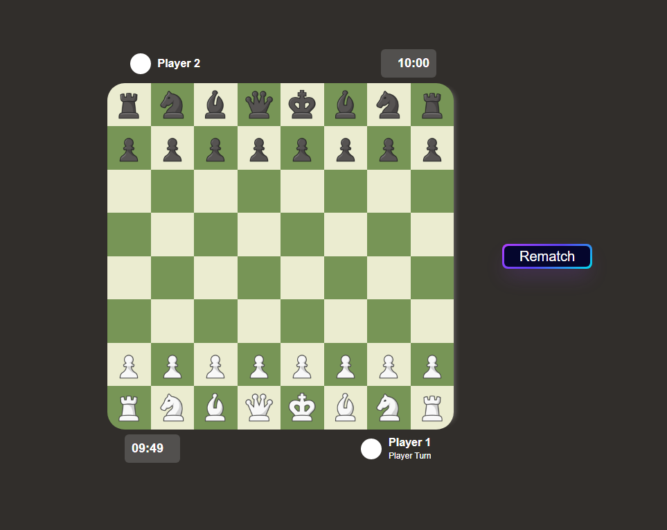

# Chess
1. The aim of chess is to checkmate your opponent’s king.
2. Familiarize yourself with the basics by going over how each piece moves.
3. White always goes first.
4. Game is over when king is captured by enemy player or if your time runs out.

---
## Description
simple chess game using HTML, CSS, Javascript. 

-not finished still missing features

---

## Images

---

## Tech Stack

  &nbsp;
  &nbsp;
  &nbsp;

---

## Upcoming Features    

    - allow users to pick a username
    - fix castling on Queen side of board
    - add ability for En pessant for pawns
    - add draw feature to allow for draws in close games or the ability to offer a draw to the opposing player.
    - ability to invite a friend using a unique url for multiplayer match.